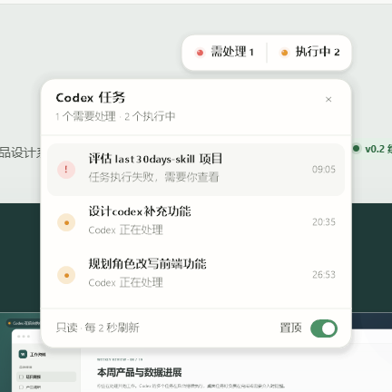

# Codex Desktop Companion

Codex Desktop Companion 是一个独立的 Windows 桌面伴侣，把个人需要但 Codex Desktop 暂未直接提供的状态信息放到触手可及的位置。

当前包含两项增强：

- **周额度胶囊**：在 Codex 左下角只显示本周剩余百分比，例如 `69%`；点击后查看重置时间并可手动刷新。
- **桌面任务灯**：可拖到任意显示器，显示需处理、执行中、空闲或离线；点击后展开多个任务的详情。



> 这是外置 companion app，不是对 Codex 安装包打补丁，也不是冒充官方插件接口。内部可执行文件暂时保留 `CodexQuotaOverlay.exe` 名称，以兼容既有单实例锁、设置目录和升级路径。

## 为什么换电脑后可以恢复

仓库保存源码、UI 原型、安装脚本、验证脚本和维护说明。新电脑只需克隆仓库并运行一次安装：

```powershell
git clone https://github.com/Yueyuyu/codex-desktop-companion.git
cd .\codex-desktop-companion
powershell -NoProfile -ExecutionPolicy Bypass -File .\install.ps1
```

安装脚本会：

1. 用 Windows 自带的 .NET Framework 编译器构建程序；
2. 把运行文件部署到 `%LOCALAPPDATA%\CodexDesktopCompanion\app`；
3. 创建当前用户的开机启动快捷方式；
4. 立即启动，并运行核心与实时验证。

此后每次登录 Windows 都会自动展示，无需再次安装。仓库换盘、改名或暂时离线也不会影响已部署的运行副本。

更完整的换机步骤见 [docs/new-computer-setup.md](docs/new-computer-setup.md)。

## 与 Codex 和额度的边界

- 不修改、注入或替换 Microsoft Store 中的 Codex 文件。
- 只调用 Codex App Server 的 `account/rateLimits/read` 与 `thread/list` 只读方法。
- 任务日志只读，不改写会话、配置、账户或任务。
- 不创建 Codex 任务、不发送模型请求，因此不会消耗或改变额度。
- Codex 更新不会覆盖本项目、安装副本或任务灯位置；本项目也不会阻止或触发 Codex 更新。

如果以后 Codex 修改 App Server 协议，组件会显示离线并重试，Codex 本体仍不受影响。如果 Codex 调整左下角布局，周额度胶囊可能需要小幅适配；桌面任务灯不依赖 Codex 窗口布局。

## 常用命令

```powershell
# 首次安装，或将仓库中的新版本重新部署到本机
.\install.ps1

# 构建并修复运行副本、开机启动项和旧路径冲突
.\repair.ps1

# 启动、停止
.\start.ps1
.\stop.ps1

# 验证安装、进程、窗口及实时数据
.\verify.ps1

# 只做无需 Codex 登录的已安装核心验证
.\verify.ps1 -Offline

# 卸载运行副本与开机启动项，默认保留任务灯位置
.\uninstall.ps1
```

本机设置保存在 `%LOCALAPPDATA%\CodexQuotaOverlay\task-light.json`。只有显式运行 `.\uninstall.ps1 -RemoveSettings` 才会删除这些设置。

## 更新项目

拉取新代码后运行：

```powershell
git pull
.\repair.ps1
```

日常开机不需要重复执行。Codex Desktop 自身更新后也不需要例行重装；只有界面位置或只读协议确实变化时，才需要更新本项目。

## 项目结构

```text
codex-desktop-companion/
├─ src/                 Windows 原生 WinForms 实现
├─ scripts/             安装与进程管理的共享函数
├─ prototypes/          任务灯交互原型，不参与运行
├─ docs/                换机、架构和故障排查说明
├─ .github/workflows/   Windows 构建与离线自测
├─ build.ps1            本机编译
├─ install.ps1          幂等安装与部署
├─ verify.ps1           核心/实时验证
├─ repair.ps1           重建并修复
└─ uninstall.ps1        安全卸载运行副本
```

## 开发与设计

开发模式不会覆盖已安装副本：

```powershell
.\build.ps1
.\start.ps1 -Development
.\verify.ps1 -Development -Offline
```

周额度胶囊与任务灯共用紧凑密度、圆角、细边和动效语言。额度胶囊只显示百分比，以整块极浅绿色表达额度充足，并在额度降低时轻微转为浅橙或浅红；文字使用同色系的低饱和深色和常规字重，不再叠加容易与任务状态混淆的圆点。点击后的额度面板与任务详情均使用逐像素透明分层渲染、柔和阴影和可中断动效。交互原型位于 `prototypes/task-light/index.html`，真实运行界面以 `src/` 为准。架构和维护边界见 [docs/architecture.md](docs/architecture.md)。

当前程序为本机即时编译的未签名可执行文件，杀毒软件或 SmartScreen 可能在首次运行新构建时扫描或提示。
