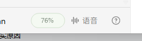
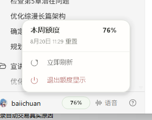

# Codex Desktop Companion

[](https://github.com/Yueyuyu/codex-desktop-companion/releases/latest)

Codex Desktop Companion 是一个独立的 Windows 桌面伴侣，把 Codex Desktop 暂未直接提供、但需要随时看到的状态放到触手可及的位置。当前公开版本为 [`v1.0.0`](https://github.com/Yueyuyu/codex-desktop-companion/releases/tag/v1.0.0)。

当前包含两个彼此独立的组件：

1. 跟随 Codex 窗口的周额度胶囊；
2. 可在桌面自由拖动的任务完成状态灯。

> 这是外置 companion app，不会修改、替换、注入或重新打包 Codex。内部可执行文件暂时保留 `CodexQuotaOverlay.exe` 名称，以兼容既有单实例锁、设置目录和升级路径。

## 功能 1：周额度胶囊

周额度胶囊位于 Codex 左下角账户区域附近，并随 Codex 主窗口移动和显隐。它不是自由拖动的桌面组件。



- 收起时只显示本周剩余百分比，例如 `76%`，不额外显示文字、图标或状态圆点；
- 额度大于 40% 时使用极浅绿色，21–40% 使用极浅橙色，20% 及以下使用极浅红色；
- 文字使用与底色同色系的低饱和深色，避免绿色底配近黑粗体造成突兀；
- 点击胶囊才展开白色详情面板，显示本周额度、重置时间、立即刷新和退出额度显示；
- 高频展示没有常驻动画，只保留短促的悬停、按下和可中断展开反馈。



## 功能 2：可拖动任务完成状态灯

任务灯是独立桌面小组件，用来显示当前任务的完成情况，而不是逐步展示模型的“执行过程”。提交 Codex 任务后，即使切换去做其他工作，也能从桌面直接判断是否仍在运行、已经完成或需要处理。


- 可拖到任意显示器的任意可见位置，松手后自动保存位置；
- 收起状态显示“需处理”“执行中”“空闲”或“Codex 离线”，并显示对应任务数量；
- 多个任务同时运行时，以数量汇总，例如“需处理 1｜执行中 2”；
- 点击任务灯展开详情，显示任务标题、状态和时间；
- 详情面板提供置顶开关，设置会保存在本机；
- 每 2 秒只读刷新任务状态；
- 新任务进入“需处理”，或全部执行中任务完成时，发送 Windows 通知。

## 与 Codex 和额度的边界

```text
Codex Desktop 当前安装
        │ 发现 codex.exe
        ▼
独立 codex.exe app-server 子进程
        │ 只读 RPC
        ├─ account/rateLimits/read ──> 周额度胶囊
        └─ thread/list + 本机 JSONL ─> 任务灯 / 详情 / 通知
```

- 不修改、注入或替换 Microsoft Store 中的 Codex 文件；
- 只调用 Codex App Server 的 `account/rateLimits/read` 与 `thread/list` 只读方法；
- 本地任务日志也只读，不改写会话、配置、账户或任务；
- 不创建 Codex 任务、不发送模型请求，因此不会消耗或改变额度；
- Codex 更新不会覆盖本项目、已安装副本或任务灯位置；本项目也不会阻止或触发 Codex 更新。

如果以后 Codex 修改 App Server 协议，组件会显示离线并重试，Codex 本体仍不受影响。如果 Codex 调整左下角布局，周额度胶囊可能需要小幅适配；独立任务灯不依赖 Codex 窗口布局。

更多实现边界见 [docs/architecture.md](docs/architecture.md)。

## 安装与换机恢复

仓库保存源码、UI 原型、安装脚本、验证脚本和维护说明。新电脑克隆仓库并安装一次：

```powershell
git clone https://github.com/Yueyuyu/codex-desktop-companion.git
cd .\codex-desktop-companion
powershell -NoProfile -ExecutionPolicy Bypass -File .\install.ps1
```

安装脚本会：

1. 使用 Windows 自带的 .NET Framework 编译器构建程序；
2. 将运行文件部署到 `%LOCALAPPDATA%\CodexDesktopCompanion\app`；
3. 创建当前用户的开机启动快捷方式；
4. 立即启动，并执行核心与实时验证。

此后每次登录 Windows 都会自动展示，无需再次安装。仓库换盘、改名或暂时离线也不会影响已部署的运行副本。

完整换机步骤见 [docs/new-computer-setup.md](docs/new-computer-setup.md)。

## 常用命令

```powershell
# 首次安装，或将仓库中的新版本重新部署到本机
.\install.ps1

# 构建并修复运行副本、开机启动项和旧路径冲突
.\repair.ps1

# 启动、停止
.\start.ps1
.\stop.ps1

# 验证安装、进程、窗口及实时数据
.\verify.ps1

# 只做无需 Codex 登录的已安装核心验证
.\verify.ps1 -Offline

# 卸载运行副本与开机启动项，默认保留任务灯位置
.\uninstall.ps1
```

本机设置保存在 `%LOCALAPPDATA%\CodexQuotaOverlay\task-light.json`。只有显式运行 `.\uninstall.ps1 -RemoveSettings` 才会删除这些设置。

## 更新项目

拉取新代码后运行：

```powershell
git pull
.\repair.ps1
```

日常开机不需要重复执行。Codex Desktop 自身更新后也不需要例行重装；只有界面位置或只读协议确实变化时，才需要更新本项目。

## 项目结构

```text
codex-desktop-companion/
├─ src/                 Windows 原生 WinForms 实现
├─ scripts/             安装与进程管理的共享函数
├─ prototypes/          任务灯交互原型，不参与运行
├─ docs/                截图、换机、架构和故障排查说明
├─ .github/workflows/   Windows 构建与离线自测
├─ VERSION              当前产品版本
├─ CHANGELOG.md         版本变化
├─ build.ps1            本机编译
├─ install.ps1          幂等安装与部署
├─ verify.ps1           核心/实时验证
├─ repair.ps1           重建并修复
└─ uninstall.ps1        安全卸载运行副本
```

## 开发与设计

开发模式不会覆盖已安装副本：

```powershell
.\build.ps1
.\start.ps1 -Development
.\verify.ps1 -Development -Offline
```

周额度胶囊与任务灯共用 Quiet Workspace 的紧凑密度、圆角、细边、柔和阴影和动效节奏，但按信息类型区分状态表达：额度是单一连续数值，使用整块低饱和胶囊；任务是多个并行类别，使用小面积状态灯和数量。交互原型位于 `prototypes/task-light/index.html`，真实运行界面以 `src/` 为准。

当前程序为本机即时编译的未签名可执行文件，杀毒软件或 SmartScreen 可能在首次运行新构建时扫描或提示。

## 版本规则

项目使用 [Semantic Versioning](https://semver.org/lang/zh-CN/)：

- `MAJOR`：安装方式、设置兼容或公开行为出现不兼容变更；
- `MINOR`：向后兼容地新增组件或能力；
- `PATCH`：向后兼容的问题修复、兼容适配、文档或视觉微调。

根目录 [`VERSION`](VERSION) 是产品版本来源，并与 `AssemblyVersion`、`AssemblyFileVersion` 和应用清单保持一致。App Server 初始化中的客户端版本属于协议标识，不代表产品版本。正式版本使用 `vX.Y.Z` Git Tag，并在 [GitHub Releases](https://github.com/Yueyuyu/codex-desktop-companion/releases) 中提供版本说明。

历史变化见 [CHANGELOG.md](CHANGELOG.md)。
