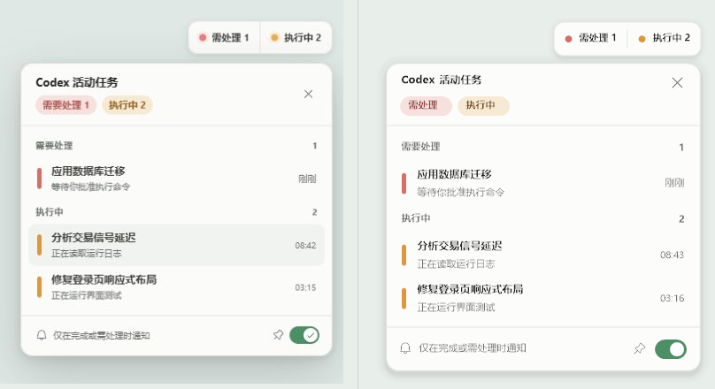
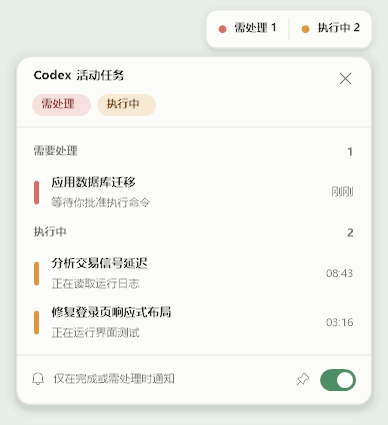
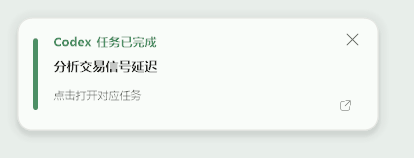
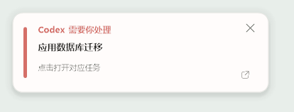

# v1.1.0 设计还原验收

本记录用于确认真实 WinForms 组件是否还原 Quiet Workspace 设计，而不是只确认 HTML 原型好看。设计来源为 UI Design Lab 与 `prototypes/task-light/`；最终运行时以 `src/` 为准。

## 验收范围

- 可拖动任务灯的收起态、任务详情、状态分组、置顶开关和关闭操作；
- 任务完成与需要处理的右下角通知；
- 鼠标悬停、按下、进入、退出和 Windows 减少动态效果；
- 浅色、深色和复杂桌面背景下的透明边缘、阴影、文字与状态色对比度；
- 点击任务行和通知后打开对应 Codex 任务。

## 两轮修正

| Before | After | Why |
| --- | --- | --- |
| 真实组件仍使用较大的圆形状态符号，信息层级与参考稿不同 | 改为 4 px 细状态轨，并保留“需要处理 / 执行中”分组和数量标签 | 状态更安静，任务标题成为视觉主角 |
| 组件内字体、符号与 UI Design Lab 不一致 | 中文统一为 `Microsoft YaHei UI`，功能图标优先使用 `Segoe Fluent Icons` | 减少系统字体回退造成的歪斜和视觉漂移 |
| 任务详情只有展示作用，点击后仍需在 Codex 侧栏查找 | 整行成为明确的点击目标，并打开 `codex://threads/<UUID>` | 让桌面提醒直接闭环到对应任务 |
| 托盘气泡在 Windows 11 上不稳定且不够明显 | 新增白色右下角通知窗口，置顶、不抢焦点、8 秒自动收起，托盘气泡只作回退 | 确保完成和需处理状态都能被看到 |
| 通知和任务灯各自定义颜色、圆角与阴影 | 统一由 `TaskLightVisualStyle` 管理视觉令牌 | 防止以后本地组件与设计项目再次分叉 |
| 进入与按下反馈缺少统一节奏 | 进入 180 ms、退出 160 ms、按下 100–140 ms，使用 Ease Out 且可中断 | 保持即时反馈，又不让高频操作显得拖沓 |

### 第一轮：需要修正

- 状态：`needs correction`
- 发现：真实任务灯与 UI 展示稿在字体、状态符号、信息分组、阴影和底部操作区上仍有明显差异；普通桌面截图还可能遗漏 layered window。
- 处理：集中视觉令牌，按真实 layered window 重绘，并新增进程内渲染截图与窗口探针。

### 第二轮：通过

- 状态：`passed`
- 结果：任务灯收起态、分组详情、完成通知和需处理通知均使用同一 Quiet Workspace 语言；辅助文字及状态文字对比度均达到 WCAG AA 的 `4.5:1` 要求。
- 交互：任务行、完成通知和需处理通知的点击均触发对应任务深链；关闭按钮、置顶开关和通知超时收起互不冲突。
- 动效：高频任务列表无装饰性常驻动画；进入、退出和按下反馈使用可中断 Ease Out，并在 Windows 关闭客户端动画时退化为近即时切换。

## 最终证据

| 真实任务灯 | 完成通知 | 需要处理通知 |
| --- | --- | --- |
|  |  |  |

最终结论：`final result: passed`
