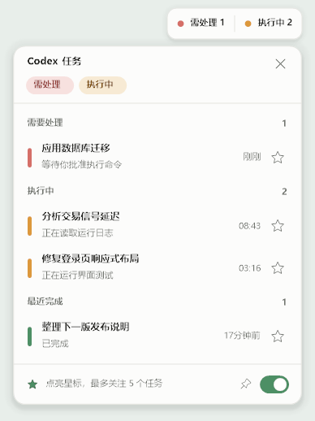
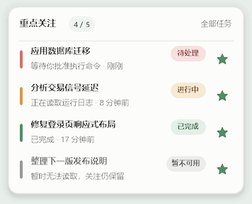

# Quiet Workspace 旧版与回退

这是 Pulse Companion 更名前的界面记录，**不是当前默认 Pulse 后台浮条**。旧组件源码在 `src/`；额度、任务、关注、通知与跳转的业务模块仍被 Pulse 复用。

## 周额度胶囊


跟随 Codex 主窗口左下角账户区域移动和显隐，不是自由拖动组件。收起只显示百分比；额度大于 40% 为浅绿，21–40% 为浅橙，20% 及以下为浅红，文字采用同色系深色。点击才展开重置时间、刷新和退出入口。


## 白色任务灯与重点关注



- 可跨显示器拖动，保存位置与置顶；收起汇总需处理、执行中、空闲或离线。
- 详情按需处理、执行中、最近完成分组。星标最多关注 5 个任务，按选择顺序常驻，不随状态重排。
- 完成后保留关注，暂不可用时不删除；点击任务通过 UUID 深链请求 Codex 跳转。



以下自绘右下角通知由共享业务模块提供，Pulse 实时版也沿用此能力；失败才回退到托盘气泡，并非 Windows 通知中心原生 Toast。

| 任务完成 | 需要处理 |
| --- | --- |
|  |  |

## 如何回退

已安装 Pulse 且保留原旧版和启动项备份时：

```powershell
.\rollback-pulse.ps1
.\verify.ps1 -StrictLive
```

脚本验证 `%LOCALAPPDATA%\CodexDesktopCompanion\startup-before-pulse.lnk` 指向旧 `app\CodexQuotaOverlay.exe` 后才切换；没有备份或旧程序时停止，不猜测路径。Pulse 副本、图标与关注偏好保留。

尚未启用 Pulse、明确只安装旧版时：

```powershell
.\install.ps1 -Legacy
```

此模式只需 Windows 自带 .NET Framework，不需要 Node.js 或 WebView2。旧版与 Pulse 实时版共用单实例锁，不应同时启动。注意 `.\repair.ps1` 的当前默认是升级到 Pulse，不是修复旧版；旧版修复需在无活动 Pulse 安装记录时用 `.\install.ps1 -Legacy`。

## 旧版开发与验收

```powershell
.\build.ps1
.\verify.ps1 -Development -Offline
.\bin\CodexQuotaProbe.exe --task-ui-preview .\artifacts\task-light-preview.png
.\bin\CodexQuotaProbe.exe --watch-ui-preview .\artifacts\watched-tasks-preview.png
```

Quiet Workspace 样式集中在 `TaskLightVisualStyle.cs`，中文为 Microsoft YaHei UI，层叠窗口由 `LayeredWindowRenderer` 绘制。历史两轮还原记录见 [design-qa.md](../design-qa.md)。这些截图与记录不代表 Pulse 当前样式；本页 `v1.2.0` 关注截图也是未发布开发功能。
